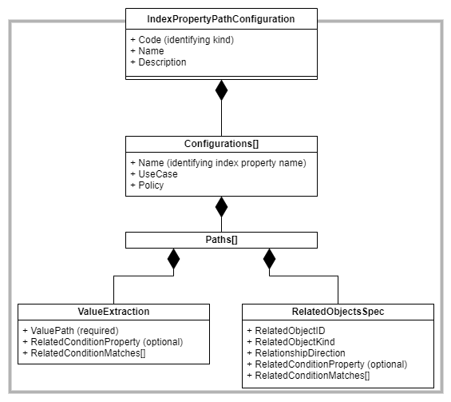

## Index Augmenter/Index Extensions

### Table of contents <a name="TOC"></a>

- [Introduction](#introduction)
- [User Cases](#use_cases)
- [Governance](#governance)
- [Accepted Limitations](#limitation)
- [Deployment](#deployment)
- [Troubleshooting](#troubleshooting)


## Introduction <a name="introduction"></a>

In this document, the terms `index augmenter` and `index extensions` are interchangeably used to describe this indexer feature.

OSDU Standard index extensions are defined by OSDU Data Definition work-streams with the intent to provide
user/application friendly, derived properties. The standard set, together with the OSDU schemas, form the
interoperability foundation. They can contribute to deliver domain specific APIs according to the Domain Driven Design
principles. 

The configurations are encoded in OSDU reference-data records, one per each major schema version. The type name
is IndexPropertyPathConfiguration. The diagram below shows the decomposition into parts.



* One IndexPropertyPathConfiguration record corresponds to one schema kind's major version, i.e., the
  IndexPropertyPathConfiguration record id for all the `schema osdu:wks:master-data--Wellbore:1.*.*` kinds is set
  to `partition-id:reference-data--IndexPropertyPathConfiguration:osdu:wks:master-data--Wellbore:1`. Code, Name and
  Descriptions are filled with meaningful data as usual for all reference-data types.
* The additional index properties are added with one JSON object each in the `Configurations[]` array. The Name defined
  the name of the index 'column', or the name of the property one can search for. The Policy decides, in the current
  usage, whether the resulting value is a single value or an array containing the aggregated, derived values.
* Each `Configurations[]` element has at least one element defined in `Paths[]`.
* The `ValueExtraction` object has one mandatory property, `ValuePath`. The other optional two properties hold value
  match conditions, i.e., the property containing the value to be matched and the value to match.
* If no `RelatedObjectsSpec` is present, the value is derived from the object being indexed.
* If `RelatedObjectsSpec` is provided, the value extraction is carried out in related objects - depending on
  the `RelationshipDirection` indirection parent/related object or children. The property holding the record id to
  follow is specified in `RelatedObjectID`, so is the expected target kind. As in `ValueExtraction`, the selection can
  be filtered by a match condition (`RelatedConditionProperty` and `RelatedConditionMatches`)

With this, the extension properties can be defined as if they were provided by a schema.

Most of the use cases deal with text (string) types. The definition of configurations is however not limited to string
types. As long as the property is known to the indexer, i.e., the source record schema is describing the types, the type
can be inferred by the indexer. This does not work for nested arrays of objects, which have not been indexed
with `"x-osdu-indexing": {"type":"nested"}`. In this case the types unknown to the Indexer Service are
string-serialized; the resulting index type is then of type `string` if the `Policy` is `ExtractFirstMatch` or `string` 
array if the `Policy` is `ExtractAllMatches`, still supporting text search.

For more information about the index augmenter, please check with the [ADR #81](https://community.opengroup.org/osdu/platform/system/indexer-service/-/issues/81) 

[Back to table of contents](#TOC)

## User Cases <a name="use_cases"></a>
- Use Case 1: WellUWI

_As a user I want to discover and match Wells by their UWI. I am aware that this is not globally reliable, however, I am
able to specify a prioritized AliasNameType list to look up value in the NameAliases array._

The configuration demonstrates extractions from the record being indexed itself. With Policy `ExtractFirstMatch`, the
first value matching the condition `RelatedConditionProperty` is equal to one of `RelatedConditionMatches`.

<details><summary>Configuration for Well, extract WellUWI from NameAliases[]</summary>

```json
{
  "data": {
    "Code": "osdu:wks:master-data--Well:1.",
    "Configurations": [
      {
        "Name": "WellUWI",
        "Policy": "ExtractFirstMatch",
        "Paths": [
          {
            "ValueExtraction": {
              "RelatedConditionMatches": [
                "{{data-partition-id}}:reference-data--AliasNameType:UniqueIdentifier:",
                "{{data-partition-id}}:reference-data--AliasNameType:RegulatoryName:",
                "{{data-partition-id}}:reference-data--AliasNameType:PreferredName:",
                "{{data-partition-id}}:reference-data--AliasNameType:CommonName:"
              ],
              "RelatedConditionProperty": "data.NameAliases[].AliasNameTypeID",
              "ValuePath": "data.NameAliases[].AliasName"
            }
          }
        ],
        "UseCase": "As a user I want to discover and match Wells by their UWI. I am aware that this is not globally reliable, however, I am able to specify a prioritized AliasNameType list to look up value in the NameAliases array."
      }
    ]
  }
}
```

</details>

[Back to table of contents](#TOC)

---

- Use Case 2: CountryNames

_As a user I want to find objects by a country name, with the understanding that an object may extend over country
boundaries._

This configuration demonstrates the extraction from related index objects - here `RelatedObjectKind`
being `osdu:wks:master-data--GeoPoliticalEntity:1.`, which are found via `RelatedObjectID` as
in `data.GeoContexts[].GeoPoliticalEntityID`. The condition is constrained to be that GeoTypeID is
GeoPoliticalEntityType:Country.

<details><summary>Configuration for Well, extract CountryNames from GeoContexts[]</summary>

```json
{
  "data": {
    "Code": "osdu:wks:master-data--Well:1.",
    "Configurations": [
      {
        "Name": "CountryNames",
        "Policy": "ExtractAllMatches",
        "Paths": [
          {
            "RelatedObjectsSpec": {
              "RelatedObjectID": "data.GeoContexts[].GeoPoliticalEntityID",
              "RelatedObjectKind": "osdu:wks:master-data--GeoPoliticalEntity:1.",
              "RelatedConditionMatches": [
                "{{data-partition-id}}:reference-data--GeoPoliticalEntityType:Country:"
              ],
              "RelatedConditionProperty": "data.GeoContexts[].GeoTypeID"
            },
            "ValueExtraction": {
              "ValuePath": "data.GeoPoliticalEntityName"
            }
          }
        ],
        "UseCase": "As a user I want to find objects by a country name, with the understanding that an object may extend over country boundaries."
      }
    ]
  }
}
```

</details>

[Back to table of contents](#TOC)

---

-Use Case 3: Wellbore Name on WellLog Children

_As a user I want to discover WellLog instances by the wellbore's name value._

A variant of this can be WellUWI from parent Wellbore &rarr; Well; in that case the value would be derived from the
already extended index values.

This configuration demonstrates extractions from multiple `Paths[]`.

<details><summary>Configuration for WellLog, extract WellboreName from parent WellboreID</summary>

```json
{
  "data": {
    "Code": "osdu:wks:work-product-component--WellLog:1.",
    "Configurations": [
      {
        "Name": "WellboreName",
        "Policy": "ExtractFirstMatch",
        "Paths": [
          {
            "RelatedObjectsSpec": {
              "RelatedObjectKind": "osdu:wks:master-data--Wellbore:1.",
              "RelatedObjectID": "data.WellboreID"
            },
            "ValueExtraction": {
              "ValuePath": "data.VirtualProperties.DefaultName"
            }
          },
          {
            "RelatedObjectsSpec": {
              "RelatedObjectKind": "osdu:wks:master-data--Wellbore:1.",
              "RelatedObjectID": "data.WellboreID"
            },
            "ValueExtraction": {
              "ValuePath": "data.FacilityName"
            }
          }
        ],
        "UseCase": "As a user I want to discover WellLog instances by the wellbore's name value."
      }
    ]
  }
}
```

</details>

[Back to table of contents](#TOC)

---

-Use Case 4: Wellbore index WellLogCurveMnemonics

_As a user I want to find Wellbores by well log mnemonics._

This configuration demonstrates the Policy `ExtractAllMatches` with related objects discovered by
RelationshipDirection `ParentToChildren`, i.e., related objects referring the indexed record.

<details><summary>Configuration for WellLog, extract WellboreName from parent WellboreID</summary>

```json
{
  "data": {
    "Code": "osdu:wks:master-data--Wellbore:1.",
    "Configurations": [
      {
        "Name": "WellLogCurveMnemonics",
        "Policy": "ExtractAllMatches",
        "Paths": [
          {
            "RelatedObjectsSpec": {
              "RelationshipDirection": "ParentToChildren",
              "RelatedObjectID": "WellboreID",
              "RelatedObjectKind": "osdu:wks:work-product-component--WellLog:1."
            },
            "ValueExtraction": {
              "ValuePath": "Curves[].Mnemonic"
            }
          }
        ],
        "UseCase": "As a user I want to find Wellbores by well log mnemonics."
      }
    ]
  }
}
```

</details>

[Back to table of contents](#TOC)

## Governance <a name="governance"></a>

OSDU Data Definition ships reference value list content for all reference-data group-type entities. The type
IndexPropertyPathConfiguration is classified as OPEN governance, which usually means that new records can be added by
platform operators. This rule must be adjusted for IndexPropertyPathConfiguration records.

### Permitted Changes to IndexPropertyPathConfiguration Records

It is permitted to

* customize the conditions for value extractions, notable the matching values in `RelatedConditionMatches`.
* add additional `Paths[]` elements to `Configurations[].Paths[]`
* add new index property configuration objects to the `Configurations[]` array. To avoid interference with future OSDU
  updates it is strongly recommended to add a namespace prefix to the Configurations[].Name, e.g., "OperatorX.WellUWI".

### Prohibited Changes to IndexPropertyPathConfiguration Records

It is not permitted to

* change the target value type of existing, OSDU shipped index extensions. Example the `ExtractionPath` to a string
  property in the original OSDU `Configurations[].ValueExtraction.ValuePath` must not be altered to a number, integer,
  or array.
* change the meaning of existing, OSDU shipped index extensions.
* remove OSDU shipped extension definitions in Configurations[].

[Back to table of contents](#TOC)

## Accepted Limitations <a name="limitation"></a>

* A change in the configurations requires re-indexing of all the records of a major schema version kind. It is the same
  limitation as an in-place schema change for any kind.

* One IndexPropertyPathConfiguration record corresponds to one schema kind's major version. Given the deployment of the 
  IndexPropertyPathConfiguration record is via the `Storage Service API`, it can't prevent users from deploying multiple records
  for one schema kind. `Indexer augmenter` engine does not merge the multiple records to one and only picks one randomly before M19. 
  After M20, the last modified record will be picked by the engine.

* To prevent more than one IndexPropertyPathConfiguration record corresponds to one schema kind's major version, all 
  IndexPropertyPathConfiguration records should have ids defined with the naming pattern described in the [Introduction](#introduction)

* All the extensions defined in the IndexPropertyPathConfiguration records refer to properties in the `data` block,
  including `ValuePath`, `RelatedObjectID`, `RelatedConditionProperty`.

* Only properties in the `data` block of records being indexed can be reached by the `ValuePath`; system properties are
  out of reach. The prefix `data.` is therefore optional and can be omitted.

* The formats/values of the extended properties are extracted from the formats/values of the related index records. If
  the formats of the original properties are unknown in the related index records, the indexer will set the value type
  of the extended properties as string or string array. (With additional complexity and schema parsing, this limitation
  can be overcome, but currently the added value seems to be marginal.)

* If the extended properties are extracted from arrays of objects indexed with
  (`"x-osdu-indexing": {"type":"flattened"}`), the indexer cannot re-construct the object properties to the
  nested objects when the policy `ExtractAllMatches` is applied. (The kind of indexing is already a deliberate choice.
  With additional complexity, this limitation can be overcome, but currently the added value seems to
  be marginal.)

* To simplify the solution, all the related kinds defined in the configuration are kinds with major version only. They
  must end with dot ".". For example: `"RelatedObjectKind": "osdu:wks:work-product-component--WellLog:1."`.

* Index updates may take time. Immediate consistency cannot be expected.

* When a kind derives extended properties from its parent(s), a new data property `data.AssociatedIdentities` is added
  on demand by the indexer. The property name `AssociatedIdentities` is therefore reserved by the Indexer and shall not
  be used in any OSDU schemas.
  Currently, the property name `AssociatedIdentities` is not in use in any of the OSDU well-known schemas. Tests will be
  implemented in the OSDU Data Definition pipeline to ensure that this reserved name does not appear as property in
  the `data` block.

[Back to table of contents](#TOC)


## Deployment <a name="deployment"></a>

Like the reference data, the deployment and un-deployment of the IndexPropertyPathConfiguration records can be through `Storege Service API`

## Troubleshooting <a name="troubleshooting"></a>

After an IndexPropertyPathConfiguration record to a major schema version kind is created or updated and 
all the records of the major schema version kind have been re-indexed. If the extended properties fail to be created in all 
the records from the `OSDU search` results, any one of the following mistakes can contribute to the failure:

* The feature flag `index-augmenter-enabled` for `Index Augmenter` is not enabled in the given data partition. Please check 
  with the service provider.

* If the extended properties are created in the data records but those extended properties are not searchable, the option `force_clean` for re-index
  is not set to `True`.

* Any one of the mandatory properties is missing, such as `data.Code`, `data.Configurations[].Name`, `data.Configurations[].Policy` 
  or `data.Configurations[].Paths[].ValueExtraction.ValuePath` and etc. 

* The value of `data.Code` in the record is not a major schema version kind which is ended with version major and dot.

* Multiple IndexPropertyPathConfiguration records to a major schema version kind may exist. Using kind 
  `osdu:wks:work-product-component--WellLog:1.` as example to run OSDU query:
```
  { 
     "kind": "osdu:wks:reference-data--IndexPropertyPathConfiguration:1.0.0",
     "query": "data.Code: "\osdu:wks:work-product-component--WellLog:1."\"
  }
```

* If not all extended properties are missing, the `Configurations[]` of the missing extended properties could be invalid. 
  The `Index Augmenter` engine can do basic syntax check on each configuration and only ignore the invalid ones. 

[Back to table of contents](#TOC)
