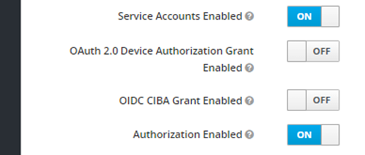

## Service Configuration for Anthos

## Environment variables:

Define the following environment variables.

Must have:

| name                                         | value                                      | description                                                                                                                                                                                                                                                                                               | sensitive? | source |
|----------------------------------------------|--------------------------------------------|-----------------------------------------------------------------------------------------------------------------------------------------------------------------------------------------------------------------------------------------------------------------------------------------------------------|------------|--------|
| `SPRING_PROFILES_ACTIVE`                     | ex `anthos`                                | Spring profile that activate default configuration for Google Cloud environment                                                                                                                                                                                                                           | false      | -      |
| `OPENID_PROVIDER_CLIENT_ID`                  | `*****`                                    | Client id that represents this service and serves to request tokens, example `workload-identity-legal`                                                                                                                                                                                                    | yes        | -      |
| `OPENID_PROVIDER_CLIENT_SECRET`              | `*****`                                    | This client secret that serves to request tokens                                                                                                                                                                                                                                                          | yes        | -      |
| `OPENID_PROVIDER_URL`                        | `https://keycloack.com/auth/realms/master` | URL of OpenID Connect provider, it will be used as `<OpenID URL> + /.well-known/openid-configuration` to auto configure endpoint for token request                                                                                                                                                        | no         | -      |
| `<ELASTICSEARCH_USER_ENV_VARIABLE_NAME>`     | ex `user`                                  | Elasticsearch user, name of that variable not defined at the service level, the name will be received through partition service. Each tenant can have it's own ENV name value, and it must be present in ENV of Indexer service, see [Partition properties set](#Properties-set-in-Partition-service)     | yes        | -      |
| `<ELASTICSEARCH_PASSWORD_ENV_VARIABLE_NAME>` | ex `password`                              | Elasticsearch password, name of that variable not defined at the service level, the name will be received through partition service. Each tenant can have it's own ENV name value, and it must be present in ENV of Indexer service, see [Partition properties set](#Properties-set-in-Partition-service) | false      | -      |

Defined in default application property file but possible to override:

| name                               | value                                                                     | description                                                               | sensitive? | source                              |
|------------------------------------|---------------------------------------------------------------------------|---------------------------------------------------------------------------|------------|-------------------------------------|
| `LOG_PREFIX`                       | `service`                                                                 | Logging prefix                                                            | no         | -                                   |
| `LOG_LEVEL`                        | `****`                                                                    | Logging level                                                             | no         | -                                   |
| `SECURITY_HTTPS_CERTIFICATE_TRUST` | ex `false`                                                                | Elastic client connection uses TrustSelfSignedStrategy(), if it is 'true' | false      | output of infrastructure deployment |
| `REDIS_SEARCH_HOST`                | ex `127.0.0.1`                                                            | Redis host                                                                | no         |                                     |
| `REDIS_SEARCH_PORT`                | ex `6379`                                                                 | Redis host port                                                           | no         |                                     |
| `REDIS_SEARCH_PASSWORD`            | ex `*****`                                                                | Redis host password                                                       | yes        |                                     |
| `REDIS_SEARCH_WITH_SSL`            | ex `true` or `false`                                                      | Redis host ssl config                                                     | no         |                                     |
| `REDIS_SEARCH_EXPIRATION`          | ex `30`                                                                   | Redis cache expiration in seconds                                         | no         |                                     |
| `PARTITION_HOST`                   | ex `https://partition.com`                                                | Partition host                                                            | no         | output of infrastructure deployment |
| `ENTITLEMENTS_HOST`                | ex `https://entitlements.com`                                             | Entitlements host                                                         | no         | output of infrastructure deployment |
| `STORAGE_HOST`                     | ex `https://storage.com`                                                  | Storage host                                                              | no         | output of infrastructure deployment |
| `SCHEMA_BASE_HOST`                 | ex `https://schema.com`                                                   | Schema service host                                                       | no         | output of infrastructure deployment |

These variables define service behavior, and are used to switch between `anthos` or `gcp` environments, their overriding and usage in mixed mode was not tested.
Usage of spring profiles is preferred.

| name                     | value                  | description                                                                                                               | sensitive? | source |
|--------------------------|------------------------|---------------------------------------------------------------------------------------------------------------------------|------------|--------|
| `PARTITION_AUTH_ENABLED` | ex `true` or `false`   | Disable or enable auth token provisioning for requests to Partition service                                               | no         | -      |
| `OQMDRIVER`              | `rabbitmq` or `pubsub` | Oqm driver mode that defines which message broker will be used                                                            | no         | -      |
| `SERVICE_TOKEN_PROVIDER` | `GCP` or `OPENID`      | Service account token provider, `GCP` means use Google service account `OPEIND` means use OpenId provider like `Keycloak` | no         | -      |
| `RABBITMQ_RETRY_DELAY`   | ex `20000`             | Message retry interval after unsuccessful processing                                                                      | no         | -      |
| `RABBITMQ_RETRY_LIMIT`   | ex `5`                 | Number of retries to send a message after unsuccessful processing                                                         | no         | -      |

### Properties set in Partition service:

Note that properties can be set in Partition as `sensitive` in that case in property `value` should be present not value itself, but ENV variable name.
This variable should be present in environment of service that need that variable.

Example:
```
    "elasticsearch.port": {
      "sensitive": false, <- value not sensitive 
      "value": "9243"  <- will be used as is.
    },
      "elasticsearch.password": {
      "sensitive": true, <- value is sensitive 
      "value": "ELASTIC_SEARCH_PASSWORD_OSDU" <- service consumer should have env variable ELASTIC_SEARCH_PASSWORD_OSDU with elastic search password
    }
```


## Elasticsearch configuration

**prefix:** `elasticsearch`

It can be overridden by:

- through the Spring Boot property `elastic-search-properties-prefix`
- environment variable `ELASTIC_SEARCH_PROPERTIES_PREFIX`

**Propertyset:**

| Property               | Description |
|------------------------|-------------|
| elasticsearch.host     | server URL  |
| elasticsearch.port     | server port |
| elasticsearch.user     | username    |
| elasticsearch.password | password    |

<details><summary>Example of a definition for a single tenant</summary></details>

```

curl -L -X PATCH 'http://partition.com/api/partition/v1/partitions/opendes' -H 'data-partition-id: opendes' -H 'Authorization: Bearer ...' -H 'Content-Type: application/json' --data-raw '{
  "properties": {
    "elasticsearch.host": {
      "sensitive": false,
      "value": "elastic.us-central1.gc.cloud.es.io"
    },
    "elasticsearch.port": {
      "sensitive": false,
      "value": "9243"
    },
    "elasticsearch.user": {
      "sensitive": true,
      "value": "<ELASTICSEARCH_USER_ENV_VARIABLE_NAME>" <- (Not actual value, just name of env variable)
    },
      "elasticsearch.password": {
      "sensitive": true,
      "value": "<ELASTICSEARCH_PASSWORD_ENV_VARIABLE_NAME>" <- (Not actual value, just name of env variable)
    }
  }
}'

```

### For OQM RabbitMQ

**prefix:** `oqm.rabbitmq`
It can be overridden by:

- through the Spring Boot property `oqm.rabbitmq.partition-properties-prefix`
- environment variable `OQM_RABBITMQ_PARTITION_PROPERTIES_PREFIX``

**Propertyset** (for two types of connection: messaging and admin operations):

| Property                    | Description            |
|-----------------------------|------------------------|
| oqm.rabbitmq.amqp.host      | messaging hostnameorIP |
| oqm.rabbitmq.amqp.port      | - port                 |
| oqm.rabbitmq.amqp.path      | - path                 |
| oqm.rabbitmq.amqp.username  | - username             |
| oqm.rabbitmq.amqp.password  | - password             |
| oqm.rabbitmq.admin.schema   | admin host schema      |
| oqm.rabbitmq.admin.host     | - host name            |
| oqm.rabbitmq.admin.port     | - port                 |
| oqm.rabbitmq.admin.path     | - path                 |
| oqm.rabbitmq.admin.username | - username             |
| oqm.rabbitmq.admin.password | - password             |

<details><summary>Example of a single tenant definition</summary>

```

curl -L -X PATCH 'https://dev.osdu.club/api/partition/v1/partitions/opendes' -H 'data-partition-id: opendes' -H 'Authorization: Bearer ...' -H 'Content-Type: application/json' --data-raw '{
  "properties": {
    "oqm.rabbitmq.amqp.host": {
      "sensitive": false,
      "value": "localhost"
    },
    "oqm.rabbitmq.amqp.port": {
      "sensitive": false,
      "value": "5672"
    },
    "oqm.rabbitmq.amqp.path": {
      "sensitive": false,
      "value": ""
    },
    "oqm.rabbitmq.amqp.username": {
      "sensitive": false,
      "value": "guest"
    },
    "oqm.rabbitmq.amqp.password": {
      "sensitive": true,
      "value": "guest"
    },

     "oqm.rabbitmq.admin.schema": {
      "sensitive": false,
      "value": "http"
    },
     "oqm.rabbitmq.admin.host": {
      "sensitive": false,
      "value": "localhost"
    },
    "oqm.rabbitmq.admin.port": {
      "sensitive": false,
      "value": "9002"
    },
    "oqm.rabbitmq.admin.path": {
      "sensitive": false,
      "value": "/api"
    },
    "oqm.rabbitmq.admin.username": {
      "sensitive": false,
      "value": "guest"
    },
    "oqm.rabbitmq.admin.password": {
      "sensitive": true,
      "value": "guest"
    }
  }
}'

```

</details>

#### Exchanges and queues configuration

RabbitMq should have exchanges and queues with names and configs:

| EXCHANGE NAME                    | EXCHANGE CONFIG                                                             | Target queue name         | Target queue config                                                  |
|----------------------------------|-----------------------------------------------------------------------------|---------------------------|----------------------------------------------------------------------|
| indexing-progress                | `Type 	fanout` <br/>`durable:	true`                                         | (Consumer not implemented) | (Consumer not implemented)                                           |
| records-changed                  | `Type 	fanout` <br/>`durable:	true`                                         | indexer-records-changed   | `x-delivery-limit:	5`<br/>`x-queue-type: quorum`<br/>`durable: true` |
| indexer-records-changed-exchange | `Type 	x-delayed-message` <br/>`durable:	true`<br/>`x-delayed-type:	fanout` | indexer-records-changed   | `x-delivery-limit:	5`<br/>`x-queue-type: quorum`<br/>`durable: true` |
| reprocess                        | `Type 	fanout` <br/>`durable:	true`                                         | indexer-reprocess         | `x-delivery-limit:	5`<br/>`x-queue-type: quorum`<br/>`durable: true` |
| indexer-reprocess-exchange       | `Type 	x-delayed-message` <br/>`durable:	true`<br/>`x-delayed-type:	fanout` | indexer-reprocess         | `x-delivery-limit:	5`<br/>`x-queue-type: quorum`<br/>`durable: true` |
| schema-changed                   | `Type 	fanout` <br/>`durable:	true`                                         | indexer-schema-changed    | `x-delivery-limit:	5`<br/>`x-queue-type: quorum`<br/>`durable: true` |
| indexer-schema-changed-exchange  | `Type 	x-delayed-message` <br/>`durable:	true`<br/>`x-delayed-type:	fanout` | indexer-schema-changed    | `x-delivery-limit:	5`<br/>`x-queue-type: quorum`<br/>`durable: true` |

## Keycloak configuration

[Keycloak service accounts setup](https://www.keycloak.org/docs/latest/server_admin/#_service_accounts)

Configure Clients. One Client per OSDU service. Set them “confidential”.


Each Client has embedded Service Account (SA) option. Enable SAs for Clients, make “Authorization enabled”:



Add `partition-and-entitlements` scope to `Default Client Scopes` and generate Keys.

Give `client-id` and `client-secret` to services, which should be authorized within the platform.

### Running E2E Tests

You will need to have the following environment variables defined.

| name                                 | value                                                           | description                                                                                       | sensitive?                              | source                              |
|--------------------------------------|-----------------------------------------------------------------|---------------------------------------------------------------------------------------------------|-----------------------------------------|-------------------------------------|
| `ELASTIC_PASSWORD`                   | `********`                                                      | Password for Elasticsearch                                                                        | yes                                     | output of infrastructure deployment |
| `ELASTIC_USER_NAME`                  | `********`                                                      | User name for Elasticsearch                                                                       | yes                                     | output of infrastructure deployment |
| `ELASTIC_HOST`                       | ex `elastic.domain.com`                                         | Host Elasticsearch                                                                                | yes                                     | output of infrastructure deployment |
| `ELASTIC_PORT`                       | ex `9243`                                                       | Port Elasticsearch                                                                                | yes                                     | output of infrastructure deployment |
| `INDEXER_HOST`                       | ex `https://os-indexer-dot-opendes.appspot.com/api/indexer/v2/` | Indexer API endpoint                                                                              | no                                      | output of infrastructure deployment |
| `ENTITLEMENTS_DOMAIN`                | ex `opendes-gcp.projects.com`                                   | OSDU R2 to run tests under                                                                        | no                                      | -                                   |
| `OTHER_RELEVANT_DATA_COUNTRIES`      | ex `US`                                                         | valid legal tag with a other relevant data countries                                              | no                                      | -                                   |
| `LEGAL_TAG`                          | ex `opendes-demo-legaltag`                                      | valid legal tag with a other relevant data countries from `DEFAULT_OTHER_RELEVANT_DATA_COUNTRIES` | no                                      | -                                   |
| `DEFAULT_DATA_PARTITION_ID_TENANT1`  | ex `opendes`                                                    | HTTP Header 'Data-Partition-ID'                                                                   | no                                      | -                                   |
| `DEFAULT_DATA_PARTITION_ID_TENANT2`  | ex `opendes`                                                    | HTTP Header 'Data-Partition-ID'                                                                   | no                                      | -                                   |
| `SEARCH_HOST`                        | ex `http://localhost:8080/api/search/v2/`                       | Endpoint of search service                                                                        | no                                      | -                                   |
| `STORAGE_HOST`                       | ex `http://os-storage-dot-opendes.appspot.com/api/storage/v2/`  | Storage API endpoint                                                                              | no                                      | output of infrastructure deployment |
| `SECURITY_HTTPS_CERTIFICATE_TRUST`   | ex `false`                                                      | Elastic client connection uses TrustSelfSignedStrategy(), if it is 'true'                         | false                                   | output of infrastructure deployment |
| `TEST_OPENID_PROVIDER_CLIENT_ID`     | `********`                                                      | Client Id for `$INTEGRATION_TESTER`                                                               | yes                                     | --                                  |
| `TEST_OPENID_PROVIDER_CLIENT_SECRET` | `********`                                                      |                                                                                                   | Client secret for `$INTEGRATION_TESTER` | --                                  |
| `TEST_OPENID_PROVIDER_URL`           | `https://keycloak.com/auth/realms/osdu`                         | OpenID provider url                                                                               | yes                                     | --                                  |

**Entitlements configuration for integration accounts**

| INTEGRATION_TESTER                                                                                                                                                                                                | NO_DATA_ACCESS_TESTER | 
|-------------------------------------------------------------------------------------------------------------------------------------------------------------------------------------------------------------------|-----------------------|
| users<br/>users.datalake.ops<br/>service.storage.creator<br/>service.entitlements.user<br/>service.search.user<br/>service.search.admin<br/>data.test1<br/>data.integration.test<br/>users@{tenant1}@{domain}.com |                       |

Execute following command to build code and run all the integration tests:

```bash
# Note: this assumes that the environment variables for integration tests as outlined
#       above are already exported in your environment.
$ (cd testing/indexer-test-anthos/ && mvn clean test)
```
