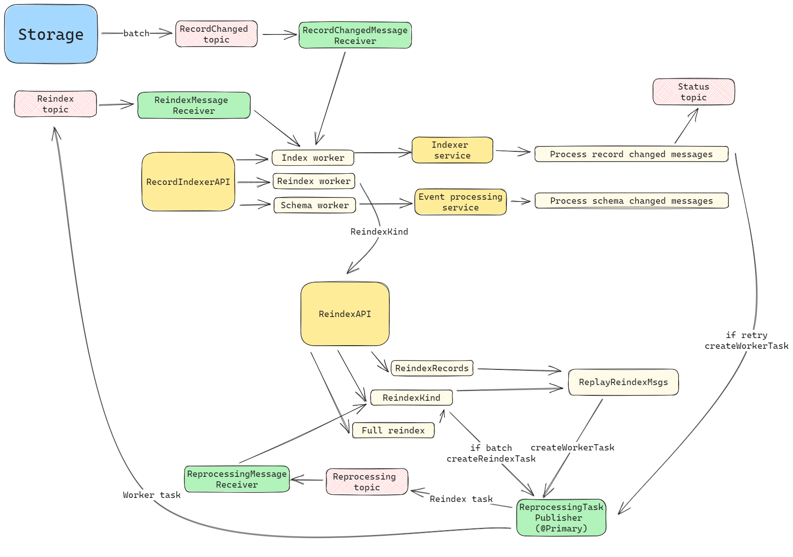

## Service Configuration for Google Cloud

## Run args

In order to run Indexer with Java 17 additional run args must be provided:

```bash
--add-opens java.base/java.lang=ALL-UNNAMED --add-opens  java.base/java.lang.reflect=ALL-UNNAMED
```

Full command:

```bash
java -jar indexer.jar --add-opens java.base/java.lang=ALL-UNNAMED --add-opens java.base/java.lang.reflect=ALL-UNNAMED
```

## Environment variables

Define the following environment variables.

Must have:

| name                                         | value                                 | description                                                                                                                                                                                                                                                                                               | sensitive? | source                                            |
|----------------------------------------------|---------------------------------------|-----------------------------------------------------------------------------------------------------------------------------------------------------------------------------------------------------------------------------------------------------------------------------------------------------------|------------|---------------------------------------------------|
| `SPRING_PROFILES_ACTIVE`                     | ex `gcp`                              | Spring profile that activate default configuration for Google Cloud environment                                                                                                                                                                                                                           | false      | -                                                 |
| `<ELASTICSEARCH_USER_ENV_VARIABLE_NAME>`     | ex `user`                             | Elasticsearch user, name of that variable not defined at the service level, the name will be received through partition service. Each tenant can have it's own ENV name value, and it must be present in ENV of Indexer service, see [Partition properties set](#properties-set-in-partition-service)     | yes        | -                                                 |
| `<ELASTICSEARCH_PASSWORD_ENV_VARIABLE_NAME>` | ex `password`                         | Elasticsearch password, name of that variable not defined at the service level, the name will be received through partition service. Each tenant can have it's own ENV name value, and it must be present in ENV of Indexer service, see [Partition properties set](#properties-set-in-partition-service) | false      | -                                                 |

Defined in default application property file but possible to override:

| name                               | value                                    | description                                                                                                         | sensitive? | source                                                       |
|------------------------------------|------------------------------------------|---------------------------------------------------------------------------------------------------------------------|------------|--------------------------------------------------------------|
| `LOG_PREFIX`                       | `service`                                | Logging prefix                                                                                                      | no         | -                                                            |
| `LOG_LEVEL`                        | `****`                                   | Logging level                                                                                                       | no         | -                                                            |
| `SECURITY_HTTPS_CERTIFICATE_TRUST` | ex `false`                               | Elastic client connection uses TrustSelfSignedStrategy(), if it is 'true'                                           | false      | output of infrastructure deployment                          |
| `REDIS_SEARCH_HOST`                | ex `127.0.0.1`                           | Redis host                                                                                                          | no         |                                                              |
| `REDIS_SEARCH_PORT`                | ex `6379`                                | Redis host port                                                                                                     | no         |                                                              |
| `REDIS_SEARCH_PASSWORD`            | ex `*****`                               | Redis host password                                                                                                 | yes        |                                                              |
| `REDIS_SEARCH_WITH_SSL`            | ex `true` or `false`                     | Redis host ssl config                                                                                               | no         |                                                              |
| `REDIS_SEARCH_EXPIRATION`          | ex `30`                                  | Redis cache expiration in seconds                                                                                   | no         |                                                              |
| `PARTITION_HOST`                   | ex `https://partition.com`               | Partition host                                                                                                      | no         | output of infrastructure deployment                          |
| `ENTITLEMENTS_HOST`                | ex `https://entitlements.com`            | Entitlements host                                                                                                   | no         | output of infrastructure deployment                          |
| `STORAGE_HOST`                     | ex `https://storage.com`                 | Storage host                                                                                                        | no         | output of infrastructure deployment                          |
| `SCHEMA_BASE_HOST`                 | ex `https://schema.com`                  | Schema service host                                                                                                 | no         | output of infrastructure deployment                          |
| `GOOGLE_APPLICATION_CREDENTIALS`   | ex `/path/to/directory/service-key.json` | Service account credentials, you only need this if running locally                                                  | yes        | <https://console.cloud.google.com/iam-admin/serviceaccounts> |
| `DEAD_LETTERING_ENABLED`           | ex `true` or `false`                     | Dead lettering configuration validation, if enabled, then service will require configured dead lettering in Pubsub. | no         | <https://console.cloud.google.com/cloudpubsub/topic/list>    |

These variables define service behavior, and are used to switch between `Reference` or `Google Cloud` environments, their overriding and usage in mixed mode was not tested.
Usage of spring profiles is preferred.

| name                     | value                  | description                                                                                                               | sensitive? | source |
|--------------------------|------------------------|---------------------------------------------------------------------------------------------------------------------------|------------|--------|
| `PARTITION_AUTH_ENABLED` | ex `true` or `false`   | Disable or enable auth token provisioning for requests to Partition service                                               | no         | -      |
| `OQMDRIVER`              | `rabbitmq` or `pubsub` | Oqm driver mode that defines which message broker will be used                                                            | no         | -      |
| `SERVICE_TOKEN_PROVIDER` | `GCP` or `OPENID`      | Service account token provider, `GCP` means use Google service account `OPEIND` means use OpenId provider like `Keycloak` | no         | -      |

## Pubsub configuration



Pubsub should have topics and subscribers with names and configs:

| TOPIC NAME                       | Subscription name          | Subscription config                                                                                                                                                                                                                |
|----------------------------------|----------------------------|------------------------------------------------------------------------------------------------------------------------------------------------------------------------------------------------------------------------------------|
| indexing-progress                | (Consumer not implemented) | (Consumer not implemented)                                                                                                                                                                                                         |
| records-changed                  | indexer-records-changed    | `Maximum delivery attempts: 10`<br/>`Retry policy: Retry after exponential backoff delay`<br/>`Minimum backoff duration: 0 seconds`<br/>`Maximum backoff duration: 30 seconds`<br/>`Grant forwarding permissions for dead letter`  |
| records-changed-dead-lettering   | (Consumer not implemented) | (Consumer not implemented)                                                                                                                                                                                                         |
| reprocess                        | indexer-reprocess          | `Maximum delivery attempts: 5`<br/>`Retry policy: Retry after exponential backoff delay`<br/>`Minimum backoff duration: 10 seconds`<br/>`Maximum backoff duration: 600 seconds`<br/>`Grant forwarding permissions for dead letter` |
| indexer-reprocess-dead-lettering | (Consumer not implemented) | (Consumer not implemented)                                                                                                                                                                                                         |
| schema-changed                   | indexer-schema-changed     | `Maximum delivery attempts: 5`<br/>`Retry policy: Retry after exponential backoff delay`<br/>`Minimum backoff duration: 10 seconds`<br/>`Maximum backoff duration: 600 seconds`<br/>`Grant forwarding permissions for dead letter` |
| schema-changed-dead-lettering    | (Consumer not implemented) | (Consumer not implemented)                                                                                                                                                                                                         |
| reindex                          | indexer-reindex            | `Maximum delivery attempts: 5`<br/>`Retry policy: Retry after exponential backoff delay`<br/>`Minimum backoff duration: 10 seconds`<br/>`Maximum backoff duration: 600 seconds`<br/>`Grant forwarding permissions for dead letter` |
| reindex-dead-lettering           | (Consumer not implemented) | (Consumer not implemented)                                                                                                                                                                                                         |

### Additional throughput configuration for PubSub subscription consumer via Partition service

It is possible, but not necessary to adjust consumer throughput via Partition service, there are 3 levels of consumers:

*MIN* - for mildly consumers, defaults(streams = 1, threads = 2, outstanding elements = 20)
*MID* - for consumers with the average load, defaults(streams = 2, threads = 2, outstanding elements = 40)
*MAX* - for maximum loaded consumers, defaults(streams = 2, threads = 5, outstanding elements = 100)

<https://community.opengroup.org/osdu/platform/system/lib/cloud/gcp/oqm/-/blob/master/src/main/java/org/opengroup/osdu/core/gcp/oqm/driver/pubsub/config/PsThroughputConfiguration.java>

```json
    "max.sub.parallel.streams": {
      "sensitive": false, 
      "value": 2 
    },
    "max.sub.thread.per.stream": {
      "sensitive": false, 
      "value": 5
    },
    "max.sub.max.outstanding.elements": {
      "sensitive": true, 
      "value": 100
    }
```

### Properties set in Partition service

Note that properties can be set in Partition as `sensitive` in that case in property `value` should be present not value itself, but ENV variable name.
This variable should be present in environment of service that need that variable.

Example:

```json
    "elasticsearch.port": {
      "sensitive": false, <- value not sensitive 
      "value": "9243"  <- will be used as is.
    },
      "elasticsearch.password": {
      "sensitive": true, <- value is sensitive 
      "value": "ELASTIC_SEARCH_PASSWORD_OSDU" <- service consumer should have env variable ELASTIC_SEARCH_PASSWORD_OSDU with elastic search password
    }
```

There is no hardcode in services, all behaviour defined by sensitivity of property.

## Indexer account configuration
Google cloud OSDU platform doesn't use a single Tenant account which provides access to all groups for each service,
instead, separate accounts should be used. But the Indexer should have access to all data groups, no matter when they were created.
To achieve that add an Indexer account to the partition configuration:
```json
    "indexer.service.account": {
        "sensitive": false,
        "value": "indexer@service.local"
    }
```
Related issue: https://community.opengroup.org/osdu/platform/system/storage/-/issues/153

## Elasticsearch configuration

**prefix:** `elasticsearch`

It can be overridden by:

- through the Spring Boot property `elastic-search-properties-prefix`
- environment variable `ELASTIC_SEARCH_PROPERTIES_PREFIX`

**Propertyset:**

| Property               | Description |
|------------------------|-------------|
| elasticsearch.host     | server URL  |
| elasticsearch.port     | server port |
| elasticsearch.user     | username    |
| elasticsearch.password | password    |

<details><summary>Example of a definition for a single tenant</summary></details>

```

curl -L -X PATCH 'http://partition.com/api/partition/v1/partitions/opendes' -H 'data-partition-id: opendes' -H 'Authorization: Bearer ...' -H 'Content-Type: application/json' --data-raw '{
  "properties": {
    "elasticsearch.host": {
      "sensitive": false,
      "value": "elastic.us-central1.gc.cloud.es.io"
    },
    "elasticsearch.port": {
      "sensitive": false,
      "value": "9243"
    },
    "elasticsearch.user": {
      "sensitive": true,
      "value": "<USER_ENV_VARIABLE_NAME>" <- (Not actual value, just name of env variable)
    },
      "elasticsearch.password": {
      "sensitive": true,
      "value": "<PASSWORD_ENV_VARIABLE_NAME>" <- (Not actual value, just name of env variable)
    }
  }
}'

```

## Google cloud service account configuration

TBD

| Required roles |
|----------------|
| -              |

### Running E2E Tests

You will need to have the following environment variables defined.

| name                                | value                                                                 | description                                                                                       | sensitive? | source                                                       |
|-------------------------------------|-----------------------------------------------------------------------|---------------------------------------------------------------------------------------------------|------------|--------------------------------------------------------------|
| `ELASTIC_PASSWORD`                  | `********`                                                            | Password for Elasticsearch                                                                        | yes        | output of infrastructure deployment                          |
| `ELASTIC_USER_NAME`                 | `********`                                                            | User name for Elasticsearch                                                                       | yes        | output of infrastructure deployment                          |
| `ELASTIC_HOST`                      | ex `elastic.domain.com`                                               | Host Elasticsearch                                                                                | yes        | output of infrastructure deployment                          |
| `ELASTIC_PORT`                      | ex `9243`                                                             | Port Elasticsearch                                                                                | yes        | output of infrastructure deployment                          |
| `GCLOUD_PROJECT`                    | ex `opendes`                                                          | Google Cloud Project Id                                                                           | no         | output of infrastructure deployment                          |
| `INDEXER_HOST`                      | ex `https://os-indexer-dot-opendes.appspot.com/api/indexer/v2/`       | Indexer API endpoint                                                                              | no         | output of infrastructure deployment                          |
| `GROUP_ID`                          | ex `opendes-gc.projects.com`                                          | OSDU R2 to run tests under                                                                        | no         | -                                                            |
| `OTHER_RELEVANT_DATA_COUNTRIES`     | ex `US`                                                               | valid legal tag with a other relevant data countries                                              | no         | -                                                            |
| `LEGAL_TAG`                         | ex `opendes-demo-legaltag`                                            | valid legal tag with a other relevant data countries from `DEFAULT_OTHER_RELEVANT_DATA_COUNTRIES` | no         | -                                                            |
| `DEFAULT_DATA_PARTITION_ID_TENANT1` | ex `opendes`                                                          | HTTP Header 'Data-Partition-ID'                                                                   | no         | -                                                            |
| `DEFAULT_DATA_PARTITION_ID_TENANT2` | ex `opendes`                                                          | HTTP Header 'Data-Partition-ID'                                                                   | no         | -                                                            |
| `SEARCH_INTEGRATION_TESTER`         | `********`                                                            | Service account for API calls. Note: this user must have entitlements configured already          | yes        | <https://console.cloud.google.com/iam-admin/serviceaccounts> |
| `SEARCH_HOST`                       | ex `http://localhost:8080/api/search/v2/`                             | Endpoint of search service                                                                        | no         | -                                                            |
| `STORAGE_HOST`                      | ex `http://os-storage-dot-opendes.appspot.com/api/storage/v2/`        | Storage API endpoint                                                                              | no         | output of infrastructure deployment                          |
| `SECURITY_HTTPS_CERTIFICATE_TRUST`  | ex `false`                                                            | Elastic client connection uses TrustSelfSignedStrategy(), if it is 'true'                         | false      | output of infrastructure deployment                          |
| `CUCUMBER_OPTIONS`                  | `--tags '~@indexer-extended'` OR `--tags '~@* and @indexer-extended'` | By default `--tags '~@indexer-extended'` to disable experimental feature testing                  | no         | --                                                           |

**Entitlements configuration for integration accounts**

| INTEGRATION_TESTER                                                                                                                                                                                                 | NO_DATA_ACCESS_TESTER |
|--------------------------------------------------------------------------------------------------------------------------------------------------------------------------------------------------------------------|-----------------------|
| users<br/>users.datalake.ops<br/>service.storage.creator<br/>service.entitlements.user<br/>service.search.user<br/>service.search.admin<br/>data.test1<br/>data.integration.test<br/>users@{tenant1}@{groupId}.com |

Execute following command to build code and run all the integration tests:

```bash
# Note: this assumes that the environment variables for integration tests as outlined
#       above are already exported in your environment.
$ (cd testing/indexer-test-gc/ && mvn clean test)
```
