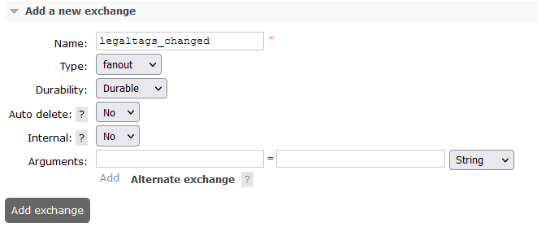

## Service Configuration for Anthos

## Environment variables:

Define the following environment variables.

Must have:

| name | value | description | sensitive? | source |
| ---  | ---   | ---         | ---        | ---    |
| `SPRING_PROFILES_ACTIVE` | ex `anthos` | Spring profile that activate default configuration for GCP environment | false | - |
| `OPENID_PROVIDER_CLIENT_ID` | `*****` |  Client id that represents this service and serves to request tokens, example `workload-identity-legal` |yes| - |
| `OPENID_PROVIDER_CLIENT_SECRET` | `*****` | This client secret that serves to request tokens| yes | - |
| `OPENID_PROVIDER_URL` | `https://keycloack.com/auth/realms/master` | URL of OpenID Connect provider, it will be used as `<OpenID URL> + /.well-known/openid-configuration` to auto configure endpoint for token request  | no | - |

Defined in default application property file but possible to override:

| name | value | description | sensitive? | source |
| ---  | ---   | ---         | ---        | ---    |
| `LOG_PREFIX` | `service` | Logging prefix | no | - |
| `LOG_LEVEL` | `****` | Logging level | no | - |
| `SECURITY_HTTPS_CERTIFICATE_TRUST` | ex `false` | Elastic client connection uses TrustSelfSignedStrategy(), if it is 'true' | false | output of infrastructure deployment |
| `REDIS_SEARCH_HOST` | ex `127.0.0.1` | Redis host for search | no | https://console.cloud.google.com/memorystore/redis/instances |
| `REDIS_SEARCH_PORT` | ex `6379` | Redis host for search | no | https://console.cloud.google.com/memorystore/redis/instances |
| `REDIS_GROUP_HOST` | ex `127.0.0.1` | Redis host for groups | no | https://console.cloud.google.com/memorystore/redis/instances |
| `REDIS_GROUP_PORT` | ex `6379` | Redis host for search | no | https://console.cloud.google.com/memorystore/redis/instances |
| `PARTITION_HOST` | ex `https://partition.com` | Partition host | no | output of infrastructure deployment |
| `ENTITLEMENTS_HOST` | ex `https://entitlements.com` | Entitlements host | no | output of infrastructure deployment |
| `STORAGE_HOST` | ex `https://storage.com` | Storage host | no | output of infrastructure deployment |
| `INDEXER_QUEUE_HOST` | ex `http://indexer-queue/api/indexer-queue/v1/_dps/task-handlers/enqueue` | Indexer-Queue host endpoint used for reprocessing tasks| no | output of infrastructure deployment |
| `SCHEMA_BASE_HOST` | ex `https://schema.com` | Schema service host | no | output of infrastructure deployment |

These variables define service behavior, and are used to switch between `anthos` or `gcp` environments, their overriding and usage in mixed mode was not tested.
Usage of spring profiles is preferred.

| name | value | description | sensitive? | source |
| ---  | ---   | ---         | ---        | ---    |
| `PARTITION_AUTH_ENABLED` | ex `true` or `false` | Disable or enable auth token provisioning for requests to Partition service | no | - |
| `OQMDRIVER` | `rabbitmq` or `pubsub` | Oqm driver mode that defines which message broker will be used | no | - |
| `SERVICE_TOKEN_PROVIDER` | `GCP` or `OPENID` |Service account token provider, `GCP` means use Google service account `OPEIND` means use OpenId provider like `Keycloak` | no | - |

## Elasticsearch configuration

### Properties set in Partition service:

**prefix:** `elasticsearch`

It can be overridden by:

- through the Spring Boot property `elastic-search-properties-prefix`
- environment variable `ELASTIC_SEARCH_PROPERTIES_PREFIX`

**Propertyset:**

| Property | Description |
| --- | --- |
| elasticsearch.host | server URL |
| elasticsearch.port | server port |
| elasticsearch.configuration | username and password |

<details><summary>Example of a definition for a single tenant</summary></details>

```

curl -L -X PATCH 'http://partition.com/api/partition/v1/partitions/opendes' -H 'data-partition-id: opendes' -H 'Authorization: Bearer ...' -H 'Content-Type: application/json' --data-raw '{
  "properties": {
    "elasticsearch.host": {
      "sensitive": false,
      "value": "elastic.us-central1.gcp.cloud.es.io"
    },
    "elasticsearch.port": {
      "sensitive": false,
      "value": "9243"
    },
    "elasticsearch.configuration": {
      "sensitive": true,
      "value": "elasticuser:elasticpassword"
    }
  }
}'

```

### For OQM RabbitMQ

**prefix:** `oqm.rabbitmq`
It can be overridden by:

- through the Spring Boot property `oqm.rabbitmq.partition-properties-prefix`
- environment variable `OQM_RABBITMQ_PARTITION_PROPERTIES_PREFIX``

**Propertyset** (for two types of connection: messaging and admin operations):

| Property | Description |
| --- | --- |
| oqm.rabbitmq.amqp.host | messaging hostnameorIP |
| oqm.rabbitmq.amqp.port | - port |
| oqm.rabbitmq.amqp.path | - path |
| oqm.rabbitmq.amqp.username | - username |
| oqm.rabbitmq.amqp.password | - password |
| oqm.rabbitmq.admin.schema | admin host schema |
| oqm.rabbitmq.admin.host | - host name |
| oqm.rabbitmq.admin.port | - port |
| oqm.rabbitmq.admin.path | - path |
| oqm.rabbitmq.admin.username | - username |
| oqm.rabbitmq.admin.password | - password |

<details><summary>Example of a single tenant definition</summary>

```

curl -L -X PATCH 'https://dev.osdu.club/api/partition/v1/partitions/opendes' -H 'data-partition-id: opendes' -H 'Authorization: Bearer ...' -H 'Content-Type: application/json' --data-raw '{
  "properties": {
    "oqm.rabbitmq.amqp.host": {
      "sensitive": false,
      "value": "localhost"
    },
    "oqm.rabbitmq.amqp.port": {
      "sensitive": false,
      "value": "5672"
    },
    "oqm.rabbitmq.amqp.path": {
      "sensitive": false,
      "value": ""
    },
    "oqm.rabbitmq.amqp.username": {
      "sensitive": false,
      "value": "guest"
    },
    "oqm.rabbitmq.amqp.password": {
      "sensitive": true,
      "value": "guest"
    },

     "oqm.rabbitmq.admin.schema": {
      "sensitive": false,
      "value": "http"
    },
     "oqm.rabbitmq.admin.host": {
      "sensitive": false,
      "value": "localhost"
    },
    "oqm.rabbitmq.admin.port": {
      "sensitive": false,
      "value": "9002"
    },
    "oqm.rabbitmq.admin.path": {
      "sensitive": false,
      "value": "/api"
    },
    "oqm.rabbitmq.admin.username": {
      "sensitive": false,
      "value": "guest"
    },
    "oqm.rabbitmq.admin.password": {
      "sensitive": true,
      "value": "guest"
    }
  }
}'

```

</details>

#### Exchanges and queues configuration

At RabbitMq should be created exchange with name:

**name:** `indexing-progress`



## Keycloak configuration

[Keycloak service accounts setup](https://www.keycloak.org/docs/latest/server_admin/#_service_accounts)

Configure Clients. One Client per OSDU service. Set them “confidential”.


Each Client has embedded Service Account (SA) option. Enable SAs for Clients, make “Authorization enabled”:


Add `partition-and-entitlements` scope to `Default Client Scopes` and generate Keys.

Give `client-id` and `client-secret` to services, which should be authorized within the platform.